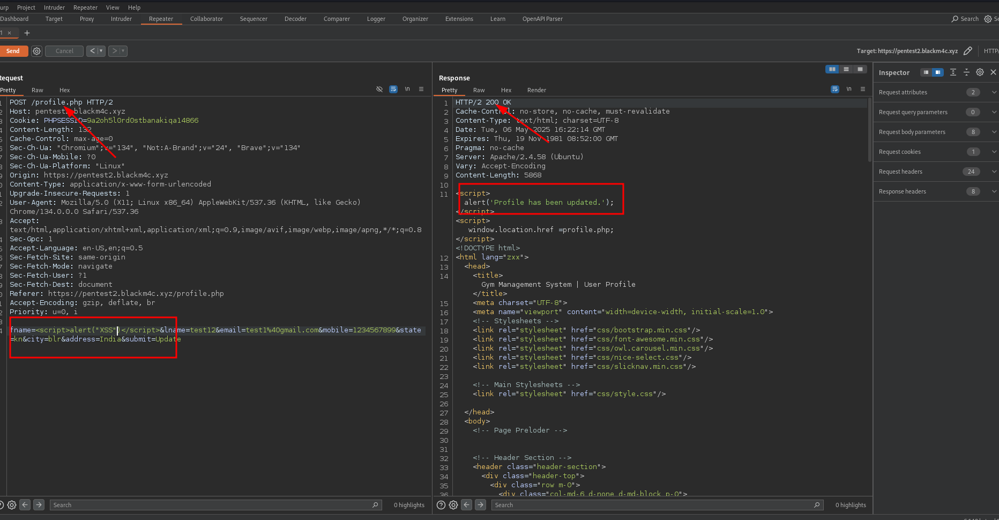
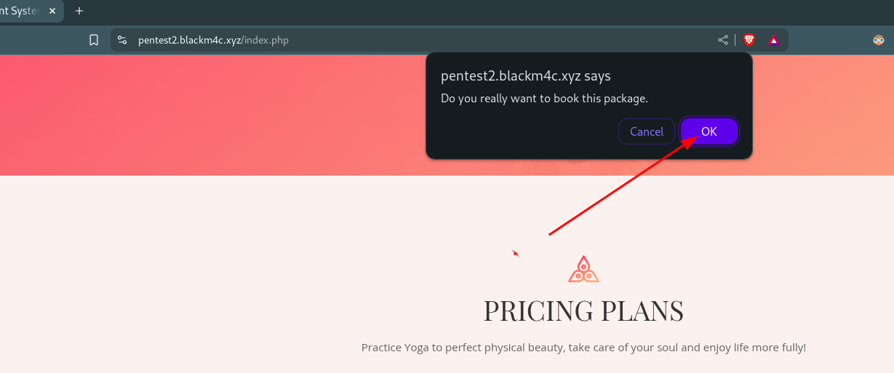
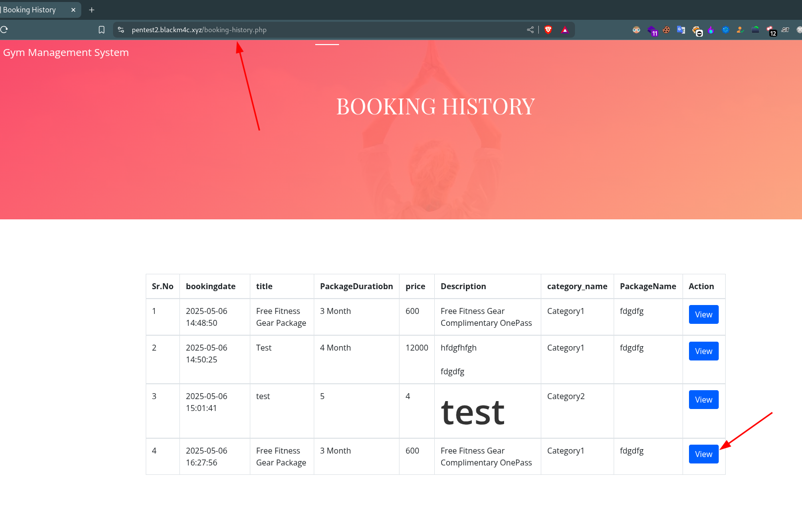
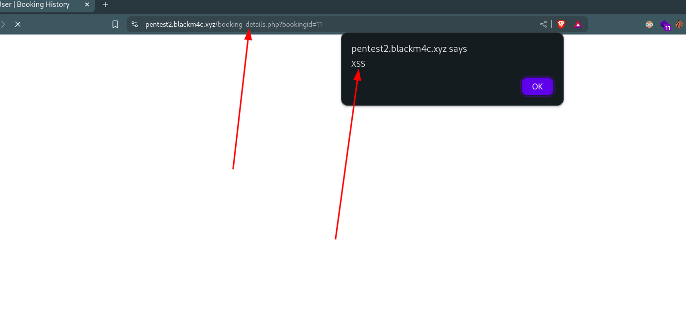
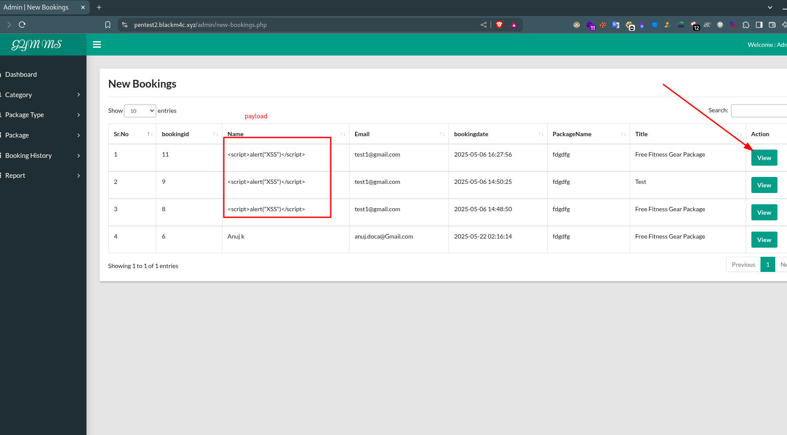
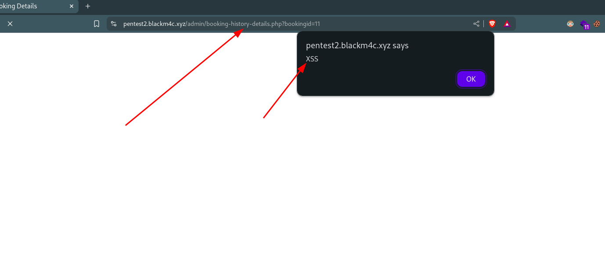

# Stored Cross-Site Scripting (XSS) Vulnerability Report

## Affected Product:

| **Attribute**           | **Details**                                                                 |
|-------------------------|-----------------------------------------------------------------------------|
| **Vendor**              | PHPGurukul                                                                  |
| **Application Name**    | GYM Management System using PHP and MySQL V1.2                              |
| **Version(s) Affected** | V 1.2                                                                       |
| **Vulnerability**       | Stored Cross-Site Scripting (XSS)                                           |
| **Affected Path**       | `domain.com/admin/booking-history-details.php`, `domain.com/booking-details.php` |
| **Affected File(s)**    | `gym/admin/booking-history-details.php`, `gym/booking-details.php`           |

🔗 **Official Website:**  
[PHPGurukul - GYM Management System using PHP and MySQL - Project Source Code](https://phpgurukul.com/gym-management-system-using-php-and-mysql/)

---

## Vulnerability Overview:

Stored Cross-Site Scripting (Stored XSS) is a security vulnerability where malicious scripts are permanently stored on the server (e.g., in a database). When another user—often an administrator—views the stored data, the script is executed in their browser.

In this case, an authenticated user can inject malicious JavaScript or HTML into the first name field. After booking a package, the request is sent to the admin dashboard. When the admin views the booking information on the `admin/booking-history-details.php` page, the script is triggered. This can lead to:

- Cookie theft  
- Session hijacking  
- Unwanted actions performed on behalf of the admin  

---

## Steps to Reproduce:

> ⚠️ **Note:** I downloaded the project source and hosted it on my Virtual Private Server (VPS) at the domain: `pentest2.blackm4c.xyz`.

> ⚠️ **Note:** Before starting, change the file name `gym/Booking-History.php -> gym/booking-history.php` as the developer forgot to update it.

1. **Register a new user or use an existing user:**

   - To register a new user, go to: `https://domain.com/registration.php`.  
     Use a test name without payload.

   - For an existing user, login at: `https://domain.com/login.php`  
     Credentials:  
     - Username: `john@test.com`  
     - Password: `Test@123`

2. **Once logged in, update the profile with a payload:**

   - Go to the profile update page: `https://domain.com/profile.php`  
   - Update the profile's first name with the following basic XSS payload:

     ```html
     <script>alert("XSS")</script>
     ```

   - For better testing, capture the request in Burp Suite and test with the Repeater tab.

     

3. **Book a package:**

   - Go to the homepage and book any package from the list.

     

   - When you click the book package, it asks for confirmation. Click the "OK" button.

     

4. **Redirected to the booking history page:**

   - After booking, it will redirect to the booking history page or you can navigate to:  
     `https://domain.com/booking-history.php`

     

   - Once on the page, click the "View" button, and the XSS will trigger, showing an alert on the `domain.com/booking-details.php` path.

     

   - Affected file: `gym/booking-details.php`

5. **Login to the admin panel and check the booking list:**

   - Login at: `https://domain.com/admin/login.php`

6. **View the new booking list:**

   - Navigate to: `Sidenav -> New Bookings`

     

   - Click the "View" button, and the XSS payload will trigger, showing an alert on the `domain.com/admin/booking-history-details.php` path.

     

   - Affected file: `gym/admin/booking-history-details.php`

---

## ✅ Recommended Mitigations

The developer implemented `htmlspecialchars()` in some parts of the system but missed doing so in the following files:  
- `gym/booking-details.php`
- `gym/admin/booking-history-details.php`

### **Mitigation Strategies:**

- **Input Sanitization:**  
  Strip or escape HTML/JavaScript tags from user inputs before storing them.

- **Output Encoding:**  
  Encode output data before rendering (e.g., use `htmlspecialchars()`).

- **Use Templating Engines That Auto-Escape Output:**  
  - **Twig:** `{{ name }}` auto-escapes
  - **Blade (Laravel):** `{{ $name }}` auto-escapes

- **Content Security Policy (CSP):**  
  Add a strict CSP header to limit script execution and block inline scripts.

- **HTTPOnly Cookies:**  
  Mark session cookies with `HttpOnly` to prevent JavaScript access to session data.

- **Input Validation:**  
  Validate data format, type, and length for all user inputs to ensure only valid data is accepted.

---

## Code Fix

Ensure all echoed data is escaped:

```php
<!-- Before (vulnerable) -->
<td><?php echo $row['name']; ?></td>

<!-- After (secure) -->
<td><?php echo htmlspecialchars($row['name'], ENT_QUOTES, 'UTF-8'); ?></td>
```
Apply this change to all user-generated data displayed in `booking-details.php` and `booking-history-details.php`.

## 📚 References

- [CWE-79: Improper Neutralization of Input During Web Page Generation ('Cross-site Scripting')](https://cwe.mitre.org/data/definitions/79.html)
- [CWE-614: Sensitive Cookie in HTTPS Session Without 'Secure' Attribute](https://cwe.mitre.org/data/definitions/614.html)
- [PortSwigger – Stored XSS](https://portswigger.net/web-security/cross-site-scripting/stored)  
- [OWASP – Cross-Site Scripting (XSS)](https://owasp.org/www-community/attacks/xss/)  
- [OWASP – XSS Prevention Cheat Sheet](https://cheatsheetseries.owasp.org/cheatsheets/Cross_Site_Scripting_Prevention_Cheat_Sheet.html)