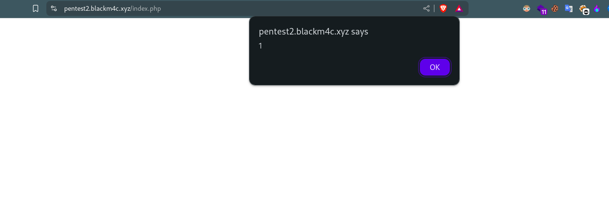

# Stored Cross-Site Scripting (XSS) Vulnerability Report

## Affected Product:

| **Attribute**           | **Details**                                                                 |
|-------------------------|-----------------------------------------------------------------------------|
| **Vendor**              | PHPGurukul                                                                  |
| **Application Name**    | GYM Management System using PHP and MySQL V1.2                              |
| **Version(s) Affected** | V 1.2                                                                       |
| **Vulnerability**       | Stored Cross-Site Scripting (XSS)                                           |
| **Affected Path**       | `domai.com/index.php`                                                       |
| **Affected File(s)**    | `gym/index.php`                                                             |

🔗 **Official Website:**  
[PHPGurukul - GYM Management System using PHP and MySQL - Project Source Code](https://phpgurukul.com/gym-management-system-using-php-and-mysql/)

---

## Vulnerability Overview:

Stored Cross-Site Scripting (Stored XSS) is a security vulnerability where malicious scripts are permanently stored on the server (e.g., in a database). When another user often an administrator views the stored data, the script is executed in their browser.

In this case, the admin can inject a malicious script into the gym package details, such as **Title**, **Duration**, and **Description**. If any user visits the affected page (in this case, `index.php`), the malicious script will be executed. As a result, an attacker could perform unauthorized actions, steal cookies, or access the browser's local storage when the victim opens the page at `domain.com`.

---

## Steps to Reproduce:

> ⚠️ **Note:** I downloaded the project source and hosted it on my Virtual Private Server (VPS) at the domain: `pentest2.blackm4c.xyz`.

> ⚠️ **Note:** Before starting, change the file name `gym/Booking-History.php` to `gym/booking-history.php`, as the developer forgot to update it.

1. **Login as the admin user using the given credentials:**
    - **Email:** admin@gmail.com
    - **Password:** Test@12345

2. **Once logged in, navigate to the manage package or create a new package:**
    - In the side navigation bar, go to `Packages` → `Add` or `Manage`.
    - Both options are similar:
        - If you click "Add," you will be directed to `https://domain.com/admin/add-post.php`.
        - If you click "Manage," you need to click "Edit" for an existing package.

    The goal here is to edit/add the following fields with XSS payload
    - **Title Name**
    - **Package Duration**
    - **Description** 

    

3. **Trick the logic to save into the database for the Description field:**
    - The page uses a text editor. The first time, it will take our input and save as normal.
    - Then, view the form again. It will render as HTML code. Resubmit it, and it will save the payload directly into the database.

    Here's an image showing how the description field appears:

    

4. **After submitting the payload, check the root directory of `domain.com`:**
    - Our payload will execute without authentication needed. Just enter the domain name, and it will load the `index.php` file, triggering a popup.

    The following images show the triggered XSS:

    
    
    

5. **The vulnerability affects multiple pages:**
    - The **Title** and **Duration** fields are not sanitized, so the payload executes in multiple places.
    - I submitted this vulnerability earlier; refer to `https://github.com/blackm4c/cve/tree/master/phpgurukul/gym/1.stored_xss` for details on where else this payload executes (e.g., `Booking History Page` and `Booking History Details`).

---


## ✅ Recommended Mitigations

The developer implemented `htmlspecialchars()` in some parts of the system but missed doing so in the following file:  
- `gym/index.php`


### **Mitigation Strategies:**

- **Input Sanitization:**  
  Strip or escape HTML/JavaScript tags from user inputs before storing them.

- **Output Encoding:**  
  Encode output data before rendering (e.g., use `htmlspecialchars()`).

- **Use Templating Engines That Auto-Escape Output:**  
  - **Twig:** `{{ name }}` auto-escapes
  - **Blade (Laravel):** `{{ $name }}` auto-escapes

- **Content Security Policy (CSP):**  
  Add a strict CSP header to limit script execution and block inline scripts.

- **HTTPOnly Cookies:**  
  Mark session cookies with `HttpOnly` to prevent JavaScript access to session data.

- **Input Validation:**  
  Validate data format, type, and length for all user inputs to ensure only valid data is accepted.

---

## Code Fix

Ensure all echoed data is escaped:

```php
<!-- Before (vulnerable) -->
<td><?php echo $row['name']; ?></td>

<!-- After (secure) -->
<td><?php echo htmlspecialchars($row['name'], ENT_QUOTES, 'UTF-8'); ?></td>
```
Apply this change to all user-generated data displayed in `index.php`

## 📚 References

- [CWE-79: Improper Neutralization of Input During Web Page Generation ('Cross-site Scripting')](https://cwe.mitre.org/data/definitions/79.html)
- [PortSwigger – Stored XSS](https://portswigger.net/web-security/cross-site-scripting/stored)  
- [OWASP – Cross-Site Scripting (XSS)](https://owasp.org/www-community/attacks/xss/)  
- [OWASP – XSS Prevention Cheat Sheet](https://cheatsheetseries.owasp.org/cheatsheets/Cross_Site_Scripting_Prevention_Cheat_Sheet.html)