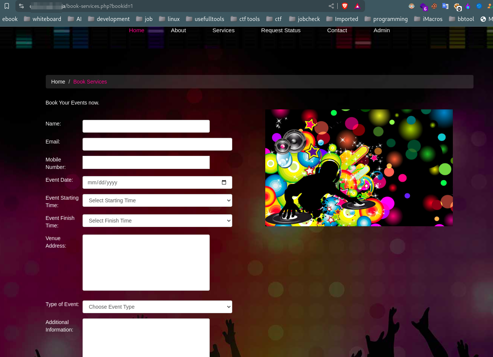
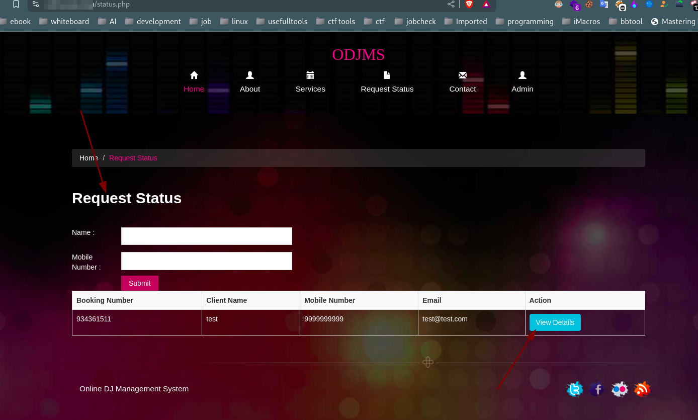
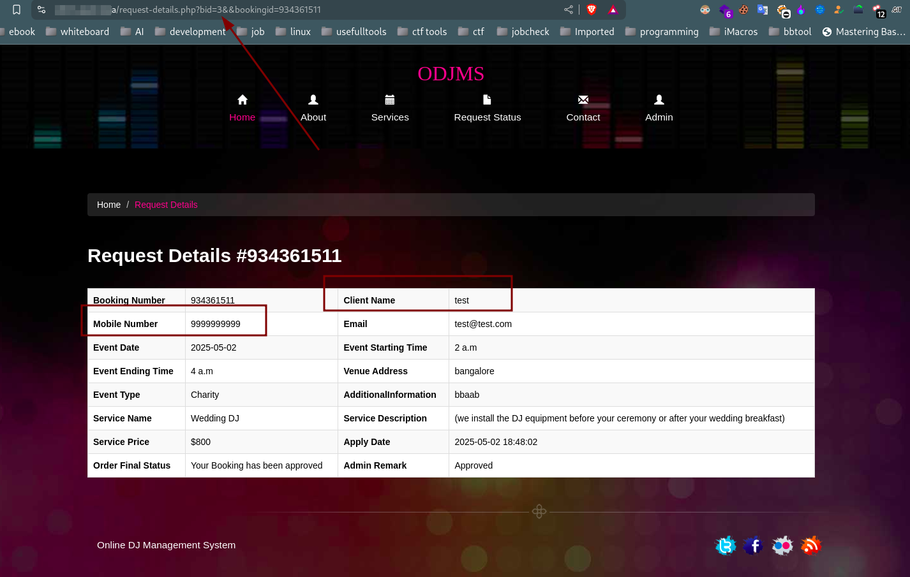
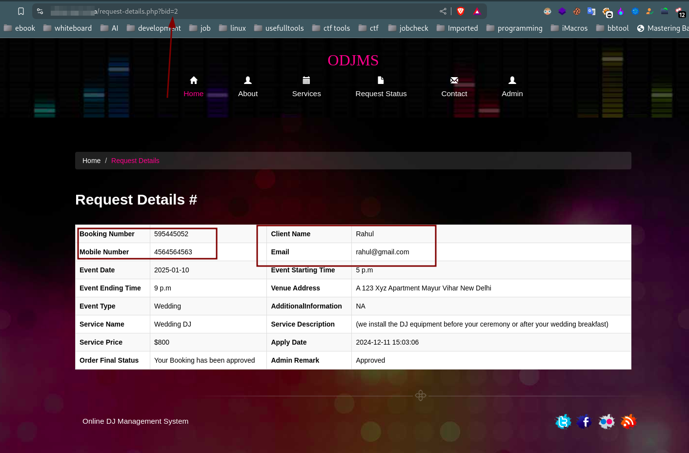

# Insecure Direct Object Reference (IDOR) Vulnerability Report

## Affected Product

| **Attribute**           | **Details**                               |
|-------------------------|-------------------------------------------|
| **Vendor**              | PHPGurukul                                |
| **Vulnerability**       | Insecure Direct Object Reference (IDOR)   |
| **Affected Path**       | `domain.com/request-details.php?bid=x&&bookingid=xxxxxxxx` |
| **Affected File**       | `odms/request-details.php`                |
| **Application Name**    | Online DJ Booking Management System       |
| **Version(s) Affected** | V2.0                                      |

## Official Website

[PHPGurukul - Online DJ Booking Management System](https://phpgurukul.com/online-dj-booking-management-system-using-php-and-mysql/)

## Vulnerability Overview

An **Insecure Direct Object Reference (IDOR)** vulnerability occurs when an attacker can access or modify data by manipulating a parameter (e.g., `bid`) in a URL. In this case, by changing the `bid` value, an attacker can view another user's personal information. This vulnerability exposes sensitive data due to a lack of proper authorization checks.

## Steps to Reproduce

> ⚠️ **Note:** I downloaded the project source and hosted it on my private virtual server.  
> For privacy reasons, I'm hiding the domain name.

1. **Book the service using the URL:**
    ```
    https://domain.com/book-services.php?bookid=1
    ```
    

2. **Fill in the form and submit the data.**  
   For testing, use the name "test" and phone number "9999999999".

3. **Once submitted, visit the status page:**
    ```
    https://domain.com/status.php
    ```

4. **Enter the name ("test") and phone number ("9999999999").**

5. **Click "View Details" to access the booking details.**
    

6. **You will be redirected to the `request-details.php` page.**

7. **On the request details page, notice the two parameters: `bid` and `bookingid`.**  
    

8. **Modify the `bookingid` by either increasing or decreasing the value.**

9. **You will now be able to see another user's personal information, such as phone number, email, name, and event details.**  
    

## Impact of IDOR Vulnerability

* **Confidentiality Breach**: Attackers can access sensitive personal information, including phone numbers, email addresses, and other private details of other users without authorization.
  
* **Data Exposure**: Unauthorized users may view or steal booking details and other private records, which could lead to identity theft or misuse of the information.

* **Privacy Violation**: Personal data is exposed to unauthorized users, violating privacy for individuals whose information is accessed without consent.

## Recommended Mitigations

1. **Implement Authorization Checks:**
   - Ensure the system enforces strict authorization checks to ensure users can only access their own data. The `bid` parameter (user ID) should be validated against the `bookingid` to guarantee the user only accesses their own booking details.

2. **Use Indirect References:**
   - Replace direct object references (like `bid` and `bookingid`) with indirect references such as hashed tokens, UUIDs, or random values. This prevents users from easily manipulating URLs to access data they shouldn't have.

3. **Implement Contextual Access Control:**
   - Enforce contextual access control based on user-specific data. For example, when accessing booking details, ensure that the `bookingid` matches the user's `bid` or is otherwise restricted to the user's own bookings.

For detailed guidelines, refer to: [OWASP Insecure Direct Object Reference Prevention Cheat Sheet](https://cheatsheetseries.owasp.org/cheatsheets/Insecure_Direct_Object_Reference_Prevention_Cheat_Sheet.html).
